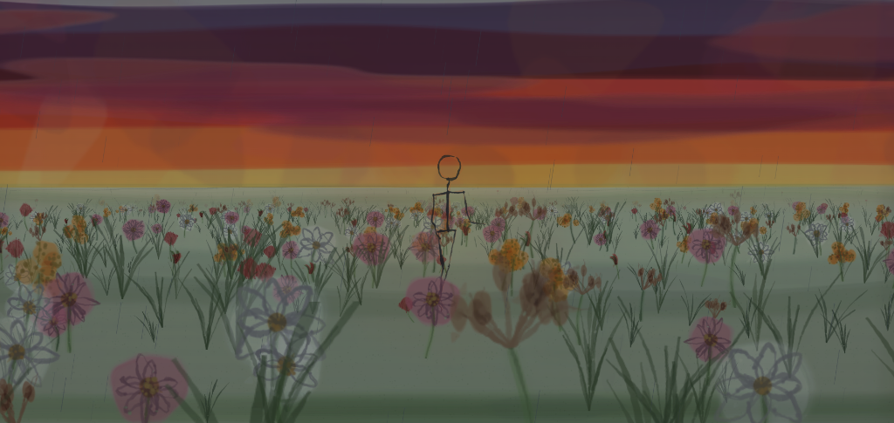

# RunAway 🌾

> An endless, procedurally generated hand-drawn sketchbook animation rendered in graphite pencil and watercolor, accompanied by the soulful music of Kaavish, infinite YouTube radio mixes, and soothing ambient rain.



---

## ✨ Features

- **Procedural Watercolor & Graphite Engine**: Real-time canvas rendering of textured rag paper, dynamic sunset sky gradients, wind-blown native grasslands, and an animated stickman runner.
- **Biomechanical Forward Kinematics Rig**: Realistic 3-gait motion system (`Run`, `Walk`, `Stumble`) with secondary spine, arm, and head sway dynamics.
- **Realistic Lighting & Dynamic Ground Shadows**:
  - **Articulated 3D Character Shadow**: Biomechanically accurate shadow projected along the low sunset vector, with multi-stage optical penumbra Gaussian blur and gentle turf contour displacement.
  - **Aesthetic Footstep Contact Prints**: Distinct, soft watercolor footprints (`32px × 10.5px`) beneath each stepping shoe that dynamically fade with stride height.
  - **Meadow Flower & Grass Shadows**: Every individual botanical stalk and flower clump casts a soft, wind-swayed watercolor shadow onto the turf.
- **Infinite YouTube Radio Mixes**:
  - **`∞` Endless Autoplay**: Seamlessly branches into YouTube's algorithmic endless radio mix (`RD<videoId>`) when the album completes, or at any time on demand.
  - **Track-Level Mix Launch**: Individual **`✦ Mix`** buttons next to every song in the playlist drawer to branch into a station seeded by that track.
  - **Live Dynamic Metadata**: Real-time track marquee, artist display, spinning CD artwork disk, and duration syncing directly from YouTube.
  - **One-Click Return**: Floating drawer banner to jump back to the original 17-track Kaavish album anytime.
- **Web Audio API Ambient Rain Engine**:
  - Pure Web Audio API procedural synthesis generating soothing pink/brown noise rain acoustics with dynamic filtering and volume controls.
  - Zero audio focus conflicts on iOS Safari and Android Chrome, allowing music and rain to play simultaneously without interruption.
  - Dramatic overcast dusk watercolor wash with heightened contrast, wind-slanted pencil rain strands, and ground splash rings.
- **Apple-esque Glassmorphism Music Player**:
  - Embedded YouTube player streaming the complete **17-track Kaavish collection** seamlessly.
  - Spinning vinyl/CD artwork disk with authentic groove texture and radial light sheen.
  - Collapsible down to a floating **squared album artwork tile** (and click to expand).
  - Searchable glassmorphic playlist drawer with live animated audio equalizer bars.
- **Silky 60/120 FPS Performance**:
  - Pre-baked zero-allocation shadow stamp textures.
  - Batched rain rendering reducing canvas draw calls by **>98%**.
  - Zero external frameworks, zero dependencies, 100% self-contained static web application.

---

## 🛠️ Tech Stack & Architecture

- **Rendering**: Pure HTML5 Canvas 2D API (`OffscreenCanvas`, `ImageData` direct buffer manipulation, procedural composite operations).
- **Core Logic**: Vanilla JavaScript (ES6+), modular zero-dependency architecture.
- **Mathematics & Procedural Generation**:
  - `Mulberry32` deterministic PRNG for infinite seeded worlds.
  - 2D Value Noise & Simplex gradient sampling for organic wind gusts and paper pulp grain.
  - `Chaikin` algorithm for smooth curve subdivision.
  - Euler forward kinematics 3D rig with horizontal ground plane shadow projection.
- **UI & Styling**: Vanilla CSS with hardware-accelerated glassmorphism (`backdrop-filter: blur(28px)`), custom range sliders, responsive flexbox layout, and spring-like cubic-bezier transitions.
- **Audio Architecture**:
  - YouTube IFrame API for high-fidelity music streaming and dynamic mix playlist management.
  - Web Audio API `AudioContext` multi-node procedural rain audio generator.

---

## 📁 Code Tree

```text
RunAway/
├── index.html          # Main HTML entrypoint with glassmorphic UI controls & infinity toggle
├── style.css           # Vanilla CSS: Glassmorphism panels, player capsule & responsive layouts
├── favicon.svg         # Minimalist vector stickman silhouette favicon (light/dark adaptive)
├── screenshot.png      # High-resolution screenshot of the animated scene
├── serve.js            # Zero-dependency local development HTTP server
├── build.js            # Production bundler (inlines assets into a single standalone HTML file)
├── test.js             # Automated unit test suite (358 tests covering PRNG, rig, & scene)
└── js/                 # Modular engine source files
    ├── rng.js          # Mulberry32 deterministic PRNG and seed utilities
    ├── geom.js         # Geometry, Chaikin curve subdivision, vector math & bounding boxes
    ├── v3.js           # 3D vector operations, camera projection & field of view calculations
    ├── ink.js          # Pencil graphite simulation, pressure taper & paper grain interaction
    ├── wash.js         # Multi-layer watercolor wash accumulation & pigment edge bleeding
    ├── paper.js        # Offscreen procedural heavy rag paper texture generator
    ├── letter.js       # Hand-drawn stroke alphabet glyph renderer
    ├── flora.js        # Procedural Australian grassland species generator (8 native botanicals)
    ├── figure.js       # Stickman biomechanical forward kinematics rig & gait animation cycles
    ├── scene.js        # Layered compositor: sunset sky, terrain, shadows, runner & rain simulation
    ├── player.js       # YouTube music player, infinite mix engine & Web Audio rain synthesizer
    └── main.js         # Main game loop, frame draining, input wiring & canvas lifecycle
```

---

## 🎵 Shoutouts & Credits

- **Music Soundtrack**: Special thanks to **[Kaavish](https://www.youtube.com/playlist?list=PLN-LsoAwRtHPvU81LsBTyN6o9cuxLIcfs)** for their timeless melodies and acoustic arrangements (*Faasle*, *Tere Pyaar Main*, *Nindiya Re*, and more).
- **Ambient Rain Soundscape**: Ambient rain acoustics powered by the Web Audio API synthesizer.

---

## 🚀 Getting Started

### 1. Run Locally
No installation or build tools required. Simply start the local server:

```bash
node serve.js
```
Open **`http://localhost:5173`** in your browser.

### 2. Run Tests
```bash
node test.js
```

### 3. Build Standalone Bundle
```bash
node build.js
```
Generates a single self-contained file at `dist/index.html` (183 KB).

---

## 📄 License

MIT License © [Madhav Bhanot](https://github.com/MadhavBhanot)
